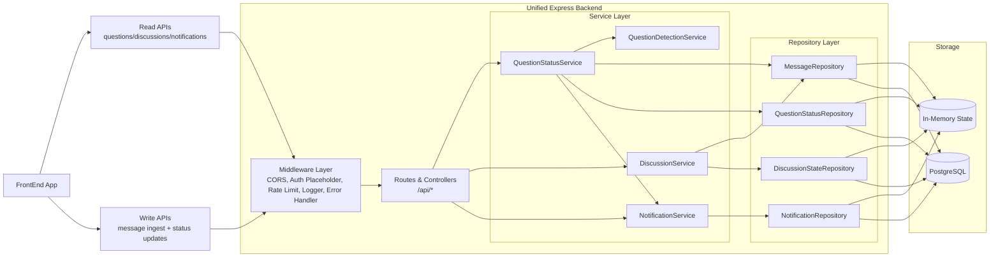

# Unified Backend Architecture (US1 + US2)

## Executive Summary
The backend is implemented as a single deployable Express service with a layered architecture: **Routes/Controllers → Services → Repositories → Data Store**. This keeps US1 (unanswered question detection) and US2 (notification on answered transition) in one cohesive execution path while maintaining clear separation of concerns.

For the current target (about 10 concurrent users), this design optimizes for low operational complexity, fast feature iteration, and deterministic behavior. It also supports both runtime modes: in-memory for local speed and PostgreSQL for durable storage, selected by environment configuration without changing API contracts.

## Architectural Description

### 1) API Surface (Single Unified App)
- A single Express app exposes all endpoints under `/api`.
- Shared middleware handles CORS, JSON parsing, auth placeholder (`x-user-id`), request logging, centralized error handling, and write-rate limiting.
- This ensures both user stories share identical cross-cutting controls and operational behavior.

### 2) Domain-Led Service Layer
Core services capture business semantics rather than endpoint mechanics:
- `QuestionDetectionService`: determines if content is likely a question.
- `QuestionStatusService`: owns lifecycle transitions (`unanswered` → `answered`) and ingests new messages.
- `NotificationService`: creates/reads/marks notifications tied to lifecycle transitions.
- `DiscussionService`: computes active discussions and applies persisted discussion status overrides.

This service boundary ensures that behavior is reusable across endpoints and testable independently from HTTP transport.

### 3) Persistence Boundary (Repository Pattern)
- Repositories abstract data access for messages, question statuses, notifications, and discussion state.
- Current implementation includes both in-memory and PostgreSQL adapters.
- The abstraction keeps service/controller contracts stable while changing storage implementations.

### 4) Unified State Transition Model
- **Message ingestion** (`POST /api/channels/:channelId/messages`) is the canonical write path.
- Every message ingestion triggers transition evaluation:
  - If message is a question → create/keep `unanswered` question status.
  - If message is a non-question from another user in same channel → mark pending questions as `answered` and emit notifications.
- Manual interactions persist through explicit endpoints:
  - `PATCH /api/questions/:questionId/answered`
  - `PATCH /api/discussions/:discussionId/status`

This avoids fragmented state mutations and keeps lifecycle logic centralized.

### 5) Why this is appropriate for ~10 users
- In-memory operations are effectively O(1) lookups + small collection scans at this load.
- Single-process architecture minimizes distributed consistency concerns and deployment overhead.
- Write-rate limiting and request validation are sufficient safeguards for an MVP traffic profile.
- Testing remains fast and deterministic, enabling rapid iteration.

## Mermaid Diagram

## Design Justification

### Cohesion and bounded responsibility
The architecture intentionally concentrates domain transitions in service classes, not controllers. Controllers stay transport-focused; services hold business invariants. This sharply reduces accidental duplication of lifecycle logic across endpoints.

### Controlled coupling with explicit seams
The repository boundary is the primary seam between business behavior and storage mechanics. This de-risks future persistence migration and supports incremental hardening (indexes, transactions, optimistic locking) without redesigning external contracts.

### Operational pragmatism for MVP scale
At 10-user scale, introducing message brokers, CQRS segregation, or distributed event pipelines would add complexity without proportional reliability gain. A synchronous single-service write path provides simpler observability and lower failure surface while preserving upgrade options.

### Transition integrity and auditability
The model uses one canonical ingestion flow and explicit mutation endpoints for manual actions. This creates predictable state transitions and clearer audit semantics, making behavior easier to test, reason about, and monitor.

### Forward evolution strategy
When traffic grows, evolution can be staged:
1. Replace in-memory repositories with persistent DB implementations.
2. Add idempotency and dedup keys for notification generation.
3. Introduce async/event processing for high-volume transition evaluation.
4. Add metrics/traces around transition latency and notification throughput.

This staged path avoids premature architecture while remaining technically defensible.
