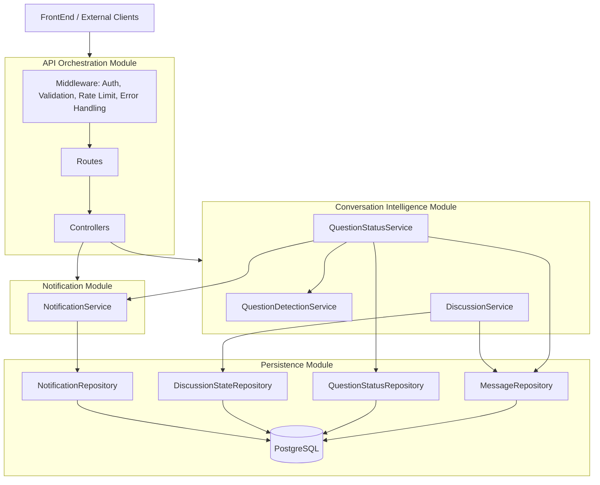
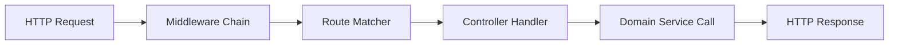
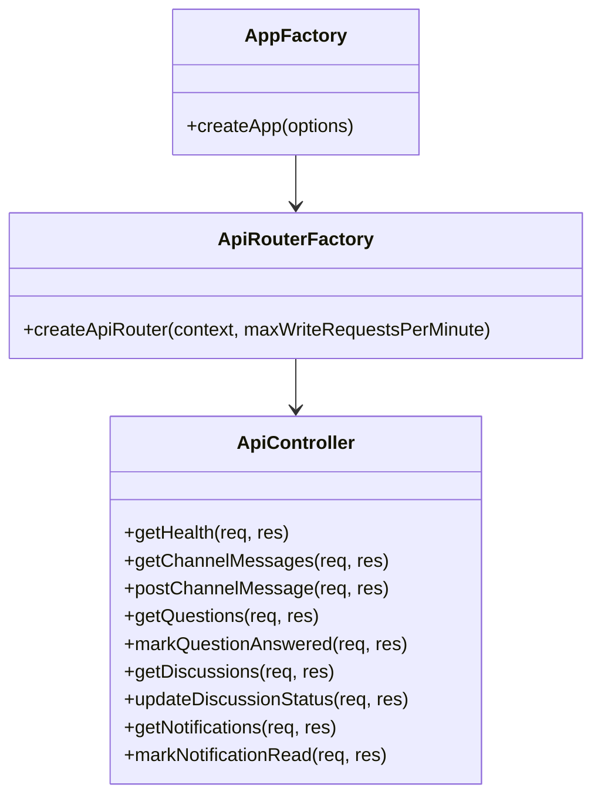
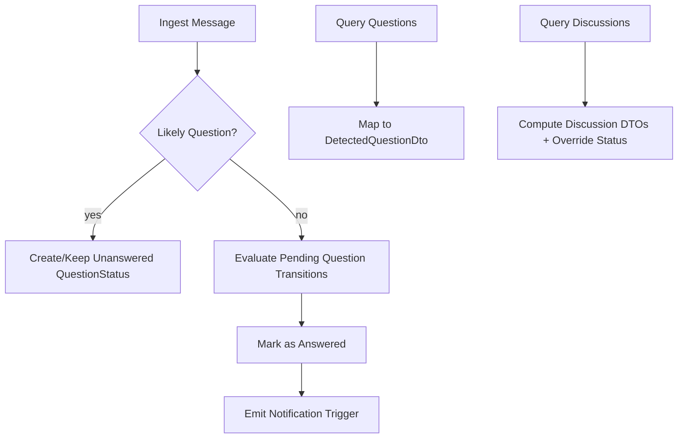
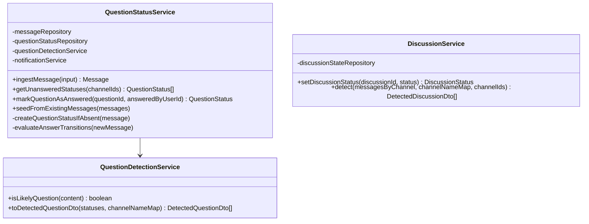
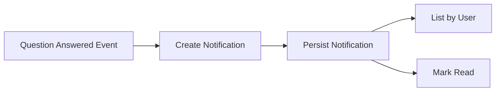
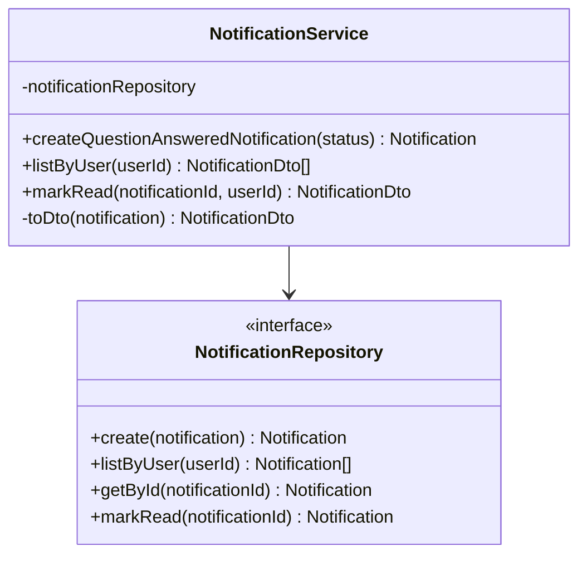
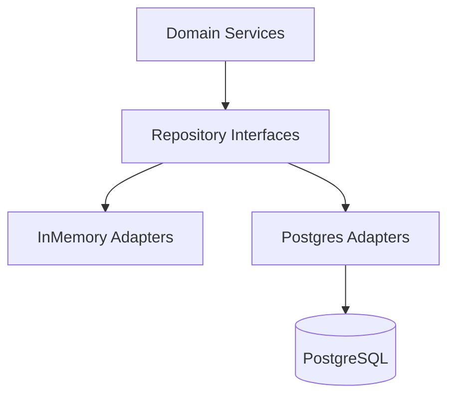
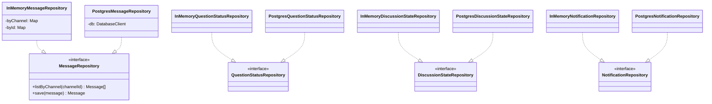

# ChatRoom Backend Modules Design (US1 + US2)

> Mermaid rendering note: Do not pass this entire markdown file as Mermaid input text. Render each fenced `mermaid` block individually, or use the standalone files in `BackEnd/diagrams/`.

## Requirements Coverage Checklist (March 18, 2026)

This section maps each requested requirement to where it is satisfied in this document and/or implementation.

| Requirement | Status | Coverage |
|---|---|---|
| Specify module features: what it can do and does not do | ✅ Done | Per-module **Features (Can / Cannot)** sections in 2, 3, 4, 5 |
| Design internal architecture with text + Mermaid + senior-architect justification | ✅ Done | Section 1 (**Text Description**, **Unified Architecture Diagram**, **Senior-Architect Justification**) |
| Define data abstraction (formal framing encouraged) | ✅ Done | Section 1 and **Formal Data Abstraction (AF/RI)** in Section 3 |
| Determine stable storage (not only in-memory) | ✅ Done (US1/US2 data) | Section 3/4/5 + implemented postgres repositories selected by `PERSISTENCE_MODE=postgres` |
| Define data schemas for storage DB | ✅ Done | SQL schemas in Sections 3 and 4 |
| Define clear external API (REST) | ✅ Done | REST endpoint lists in Sections 2, 3, and 4 |
| List class/method/field declarations, with visibility | ✅ Done | Declaration sections in 2, 3, 4, and 5 |
| Draw Mermaid class hierarchy diagram for module internals | ✅ Done | Class diagrams in 2, 3, 4, and 5 |
| Generate code for each class | ✅ Done | Generated code skeletons per module (2, 3, 4, 5) and full implementations in `src/` |

### Scope Clarification
- Stable durable persistence is implemented for **messages, question statuses, discussion overrides, and notifications** through PostgreSQL adapters.
- Channel catalog create/update is currently runtime-state based and is outside the US1/US2 persistence scope in this module design.

## 1) Unified Architecture

### Text Description
The backend is a single deployable service with clear module boundaries:
- **API Orchestration Module**: HTTP surface, middleware, routing, and controller orchestration.
- **Conversation Intelligence Module**: message ingestion, question detection, question lifecycle, discussion detection/status.
- **Notification Module**: creation/list/read of user notifications triggered by lifecycle transitions.
- **Persistence Module**: repository contracts + durable storage adapters (target: PostgreSQL).

Execution model:
1. Client sends command/query through REST endpoint.
2. Controller validates and maps payload to domain service call.
3. Service applies deterministic domain rules.
4. Repositories persist/retrieve state.
5. API returns DTOs.

This supports both user stories in one consistent path:
- **US1**: unanswered question detection and listing.
- **US2**: answered transitions create user notifications.

### Unified Architecture Diagram


### Senior-Architect Justification
- **Single service, modular internals**: keeps operational overhead low while preserving clean separations and testability.
- **Repository abstraction**: decouples domain logic from storage engine; enables migration from in-memory to durable DB with minimal API churn.
- **Deterministic transitions**: all lifecycle changes happen through explicit services, improving observability and reducing hidden side effects.
- **Incremental scalability**: for ~10 users this is cost-efficient; for growth, persistence/indexing and async workers can be introduced without rewiring external contracts.

---

## 2) Module: API Orchestration

### Features (Can / Cannot)
**Can:**
- Expose REST endpoints for messages, questions, discussions, and notifications.
- Validate incoming requests and enforce basic ownership/security checks.
- Apply cross-cutting middleware (auth placeholder, rate limiting, error handling).

**Cannot:**
- Perform complex NLP or business decisions directly (delegated to domain services).
- Guarantee business durability by itself (depends on Persistence Module).

### Internal Architecture


### Data Abstractions
- `RequestContext`: user identity (`x-user-id`), params, query, body.
- DTO mapping boundary between HTTP and domain objects.

### Stable Storage Mechanism
- Not state-owning; relies on Persistence Module.
- Operational logs should be written to durable log sink (file/ELK/Cloud logs).

### External API (REST)
- `GET /health`
- `GET /api/servers`
- `GET /api/groups`
- `GET /api/members`
- `GET /api/channels/:channelId/messages`
- `POST /api/channels/:channelId/messages`
- `GET /api/questions?channelIds=...`
- `PATCH /api/questions/:questionId/answered`
- `GET /api/discussions?channelIds=...`
- `PATCH /api/discussions/:discussionId/status`
- `GET /api/notifications?userId=...`
- `PATCH /api/notifications/:notificationId/read`

### Class/Method/Field Declarations
**Externally visible:**
- `createApp(options?: CreateAppOptions)`
- `createApiRouter(context: AppContext, maxWriteRequestsPerMinute: number)`
- `createApiController(context: AppContext)`

**Private/internal:**
- Controller handler closures (`getQuestions`, `postChannelMessage`, etc.)
- Middleware internals for rate window tracking and validation helpers

### Class Hierarchy Diagram


### Generated Code (Module Classes)
```ts
export interface CreateAppOptions {
  context?: AppContext;
  enableRequestLogging?: boolean;
}

export const createApp = (options: CreateAppOptions = {}) => {
  // express setup + middleware + route registration
};

export const createApiRouter = (context: AppContext, maxWriteRequestsPerMinute: number) => {
  // route bindings + write limiter
};

export const createApiController = (context: AppContext) => {
  // handlers delegating to services
};
```

---

## 3) Module: Conversation Intelligence

### Features (Can / Cannot)
**Can:**
- Ingest messages and create canonical message records.
- Detect likely questions.
- Track question lifecycle state (`unanswered` → `answered`).
- Detect discussions and apply manual status overrides.

**Cannot:**
- Perform semantic answer quality verification.
- Resolve ambiguous conversational context with high NLP precision.

### Internal Architecture


### Data Abstractions
- `Message`: immutable chat event.
- `QuestionStatus`: lifecycle aggregate for question tracking.
- `DetectedQuestionDto` / `DetectedDiscussionDto`: read models.

### Formal Data Abstraction (AF/RI style)

`QuestionStatus` ADT
- **Abstract value:** lifecycle state of a single question asked in a channel.
- **Operations:** create-on-question, transition-to-answered, query-unanswered, mark-answered.
- **Representation fields:** `{ id, channelId, questionMessageId, askedByUserId, askedAt, status, answeredAt?, answeredByUserId?, answeredMessageId? }`.
- **Abstraction function (AF):** maps one persisted row/object to one conceptual question lifecycle record.
- **Rep invariant (RI):**
  - `status ∈ {unanswered, answered}`
  - `answered*` fields are present iff `status=answered`
  - `questionMessageId` refers to an existing message
  - `askedAt <= answeredAt` when answered

`DiscussionStateOverride` ADT
- **Abstract value:** manual override of computed discussion status for a discussion id.
- **Operations:** set override status, get override status.
- **Representation fields:** `{ discussionId, status, updatedAt, updatedByUserId? }`.
- **AF:** row/object represents a single override for one discussion.
- **RI:** one row per `discussionId`; `status ∈ {active, detected, resolved, archived}`.

Repository interfaces (module boundary ADTs)
- **Abstract value:** collection semantics over each aggregate with persistence hidden behind interfaces.
- **AF:** concrete adapter state (memory maps or SQL rows) maps to same domain set/sequence semantics.
- **RI:** adapters must preserve identity uniqueness (`id`) and required ordering contracts (channel messages ascending by timestamp).

### Stable Storage Mechanism
**Target:** PostgreSQL with ACID transactions.
- Guarantees durability across process crash/restart.
- Supports indexing for channel/time-based queries.

### Storage Schemas
```sql
CREATE TABLE messages (
  id TEXT PRIMARY KEY,
  channel_id TEXT NOT NULL,
  user_id TEXT NOT NULL,
  user_name TEXT NOT NULL,
  user_avatar TEXT,
  content TEXT NOT NULL,
  created_at TIMESTAMPTZ NOT NULL DEFAULT NOW()
);
CREATE INDEX idx_messages_channel_created_at ON messages(channel_id, created_at);

CREATE TABLE question_status (
  id TEXT PRIMARY KEY,
  channel_id TEXT NOT NULL,
  question_message_id TEXT UNIQUE NOT NULL REFERENCES messages(id),
  question_content TEXT NOT NULL,
  asked_by_user_id TEXT NOT NULL,
  asked_by TEXT NOT NULL,
  asked_at TIMESTAMPTZ NOT NULL,
  status TEXT NOT NULL CHECK (status IN ('unanswered', 'answered')),
  answered_at TIMESTAMPTZ,
  answered_by_user_id TEXT,
  answered_message_id TEXT REFERENCES messages(id)
);
CREATE INDEX idx_question_status_channel_status ON question_status(channel_id, status);

CREATE TABLE discussion_state_override (
  discussion_id TEXT PRIMARY KEY,
  status TEXT NOT NULL CHECK (status IN ('active','detected','resolved','archived')),
  updated_at TIMESTAMPTZ NOT NULL DEFAULT NOW(),
  updated_by_user_id TEXT
);
```

### External API (REST)
- `POST /api/channels/:channelId/messages`
- `GET /api/channels/:channelId/messages`
- `GET /api/questions?channelIds=...`
- `PATCH /api/questions/:questionId/answered`
- `GET /api/discussions?channelIds=...`
- `PATCH /api/discussions/:discussionId/status`

### Class/Method/Field Declarations
**Externally visible:**
- `class QuestionDetectionService`
  - `isLikelyQuestion(content: string): boolean`
  - `toDetectedQuestionDto(statuses: QuestionStatus[], channelNameMap: Map<string,string>): DetectedQuestionDto[]`
- `class QuestionStatusService`
  - `ingestMessage(input: CreateMessageInput): Message`
  - `getUnansweredStatuses(channelIds?: string[]): QuestionStatus[]`
  - `markQuestionAsAnswered(questionId: string, answeredByUserId: string): QuestionStatus | undefined`
  - `seedFromExistingMessages(messages: Message[]): void`
- `class DiscussionService`
  - `setDiscussionStatus(discussionId: string, status: DiscussionStatus): DiscussionStatus`
  - `detect(messagesByChannel: Record<string, Message[]>, channelNameMap: Map<string,string>, channelIds?: string[]): DetectedDiscussionDto[]`

**Private/internal:**
- `QuestionStatusService.createQuestionStatusIfAbsent(...)`
- `QuestionStatusService.evaluateAnswerTransitions(...)`
- `DiscussionService` helper functions for topic/status derivation

### Class Hierarchy Diagram


### Generated Code (Module Classes)
```ts
export class QuestionDetectionService {
  isLikelyQuestion(content: string): boolean { /* regex + ? heuristic */ }
  toDetectedQuestionDto(statuses: QuestionStatus[], channelNameMap: Map<string, string>): DetectedQuestionDto[] { /* map */ }
}

export class QuestionStatusService {
  constructor(
    private readonly messageRepository: MessageRepository,
    private readonly questionStatusRepository: QuestionStatusRepository,
    private readonly questionDetectionService: QuestionDetectionService,
    private readonly notificationService: NotificationService,
  ) {}

  ingestMessage(input: CreateMessageInput): Message { /* canonical write path */ }
  getUnansweredStatuses(channelIds?: string[]): QuestionStatus[] { /* query */ }
  markQuestionAsAnswered(questionId: string, answeredByUserId: string): QuestionStatus | undefined { /* transition */ }
  seedFromExistingMessages(messages: Message[]): void { /* bootstrap */ }

  private createQuestionStatusIfAbsent(message: Message): void { /* guard + create */ }
  private evaluateAnswerTransitions(newMessage: Message): void { /* update answered */ }
}

export class DiscussionService {
  constructor(private readonly discussionStateRepository: DiscussionStateRepository) {}
  setDiscussionStatus(discussionId: string, status: DiscussionStatus): DiscussionStatus { /* persist override */ }
  detect(messagesByChannel: Record<string, Message[]>, channelNameMap: Map<string, string>, channelIds?: string[]): DetectedDiscussionDto[] { /* detect */ }
}
```

---

## 4) Module: Notification

### Features (Can / Cannot)
**Can:**
- Create notifications on question answered transitions.
- List notifications by user.
- Mark notification read with ownership checks.

**Cannot:**
- Deliver push/email/SMS channels (in-app only).
- Guarantee exactly-once notification generation without idempotency keying in storage.

### Internal Architecture


### Data Abstractions
- `Notification` domain entity.
- `NotificationDto` read-model for API responses.

### Stable Storage Mechanism
**Target:** PostgreSQL table with user/time indexes and optional idempotency unique key.

### Storage Schemas
```sql
CREATE TABLE notifications (
  id TEXT PRIMARY KEY,
  type TEXT NOT NULL CHECK (type IN ('question_answered')),
  user_id TEXT NOT NULL,
  question_message_id TEXT NOT NULL REFERENCES messages(id),
  channel_id TEXT NOT NULL,
  message TEXT NOT NULL,
  is_read BOOLEAN NOT NULL DEFAULT FALSE,
  created_at TIMESTAMPTZ NOT NULL DEFAULT NOW()
);
CREATE INDEX idx_notifications_user_created_at ON notifications(user_id, created_at DESC);
```

### External API (REST)
- `GET /api/notifications?userId=...`
- `PATCH /api/notifications/:notificationId/read`

### Class/Method/Field Declarations
**Externally visible:**
- `class NotificationService`
  - `createQuestionAnsweredNotification(status: QuestionStatus): Notification`
  - `listByUser(userId: string): NotificationDto[]`
  - `markRead(notificationId: string, userId: string): NotificationDto | undefined`

**Private/internal:**
- `NotificationService.toDto(notification: Notification): NotificationDto`
- internal sequence/id strategy (`notificationCounter` today; DB sequence in production)

### Class Hierarchy Diagram


### Generated Code (Module Classes)
```ts
export class NotificationService {
  constructor(private readonly notificationRepository: NotificationRepository) {}

  createQuestionAnsweredNotification(status: QuestionStatus): Notification { /* build + save */ }
  listByUser(userId: string): NotificationDto[] { /* query + map */ }
  markRead(notificationId: string, userId: string): NotificationDto | undefined { /* ownership */ }

  private toDto(notification: Notification): NotificationDto { /* map fields */ }
}
```

---

## 5) Module: Persistence

### Features (Can / Cannot)
**Can:**
- Provide durable read/write contracts for all domain aggregates.
- Support implementation swaps (`InMemory*Repository` -> `Postgres*Repository`).
- Enforce schema-level invariants and query indexes.

**Cannot:**
- Encode domain business policy (must remain in service layer).

### Internal Architecture


### Data Abstractions
- Repository interfaces per aggregate:
  - `MessageRepository`
  - `QuestionStatusRepository`
  - `DiscussionStateRepository`
  - `NotificationRepository`

### Stable Storage Mechanism
- **Primary recommendation:** PostgreSQL 15+.
- Reasons: transactional guarantees, mature indexing, simple ops for current scale, future-ready.

### API for External Callers
- Not exposed directly over HTTP.
- Used internally by services through explicit TypeScript interfaces.

### Class/Method/Field Declarations
**Externally visible interfaces/classes:**
- `interface MessageRepository`
- `interface QuestionStatusRepository`
- `interface DiscussionStateRepository`
- `interface NotificationRepository`
- `class InMemoryMessageRepository`
- `class InMemoryQuestionStatusRepository`
- `class InMemoryDiscussionStateRepository`
- `class InMemoryNotificationRepository`
- (Target) `class PostgresMessageRepository`, `PostgresQuestionStatusRepository`, `PostgresDiscussionStateRepository`, `PostgresNotificationRepository`

**Private/internal fields:**
- in-memory maps (`byId`, `byChannel`, `stateByDiscussionId`)
- SQL client and prepared statements in postgres adapters

### Class Hierarchy Diagram


### Generated Code (Durable Adapter Skeletons)
```ts
export interface DatabaseClient {
  query<T>(sql: string, params?: unknown[]): Promise<{ rows: T[] }>;
}

export class PostgresMessageRepository implements MessageRepository {
  constructor(private readonly db: DatabaseClient) {}

  async listByChannel(channelId: string): Promise<Message[]> {
    const result = await this.db.query<Message>(
      'SELECT * FROM messages WHERE channel_id = $1 ORDER BY created_at ASC',
      [channelId],
    );
    return result.rows;
  }

  async save(message: Message): Promise<Message> {
    await this.db.query(
      `INSERT INTO messages (id, channel_id, user_id, user_name, user_avatar, content, created_at)
       VALUES ($1,$2,$3,$4,$5,$6,$7)
       ON CONFLICT (id) DO UPDATE SET content = EXCLUDED.content`,
      [message.id, message.channelId, message.userId, message.userName, message.userAvatar, message.content, message.timestamp],
    );
    return message;
  }
}
```

---

## 6) Production Notes
- Current implementation is functionally complete for US1/US2 and supports both repository modes:
  - `memory` mode for local development,
  - `postgres` mode for durable storage.
- Durable mode is selected via environment variable `PERSISTENCE_MODE=postgres` with `DATABASE_URL` configured.
- Service and controller contracts are stable across storage mode selection, minimizing frontend/API churn.
