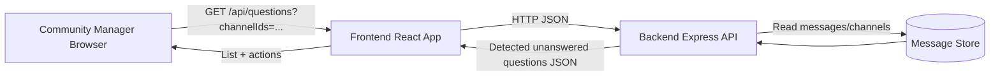
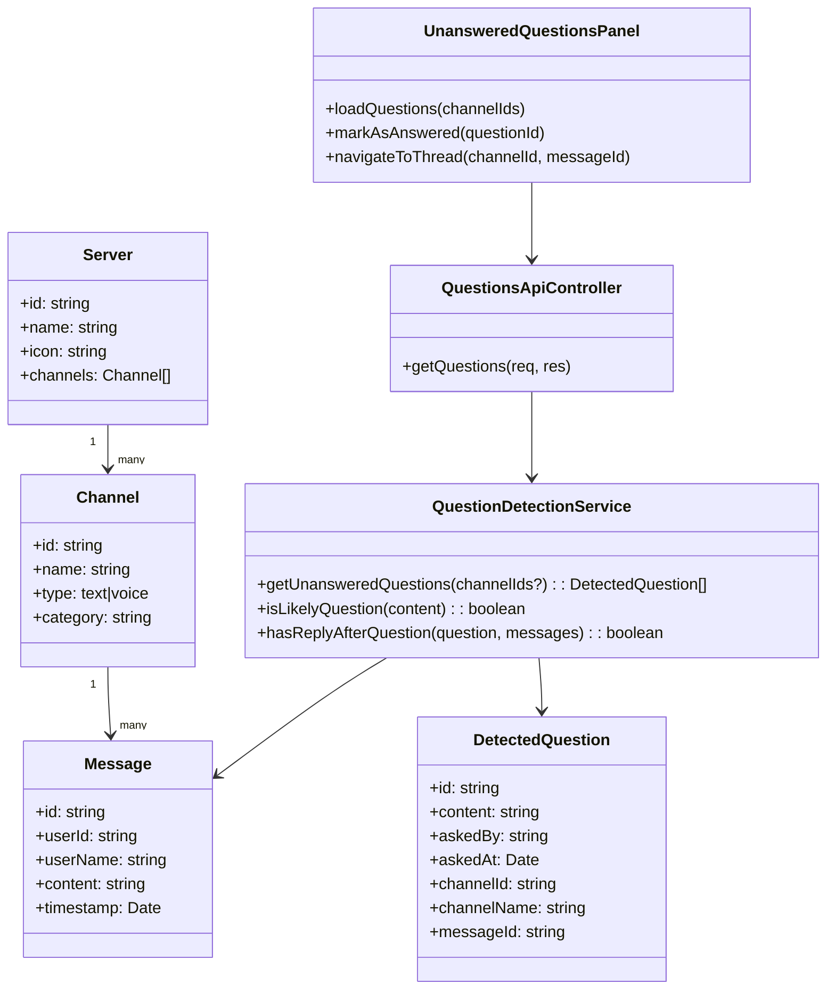
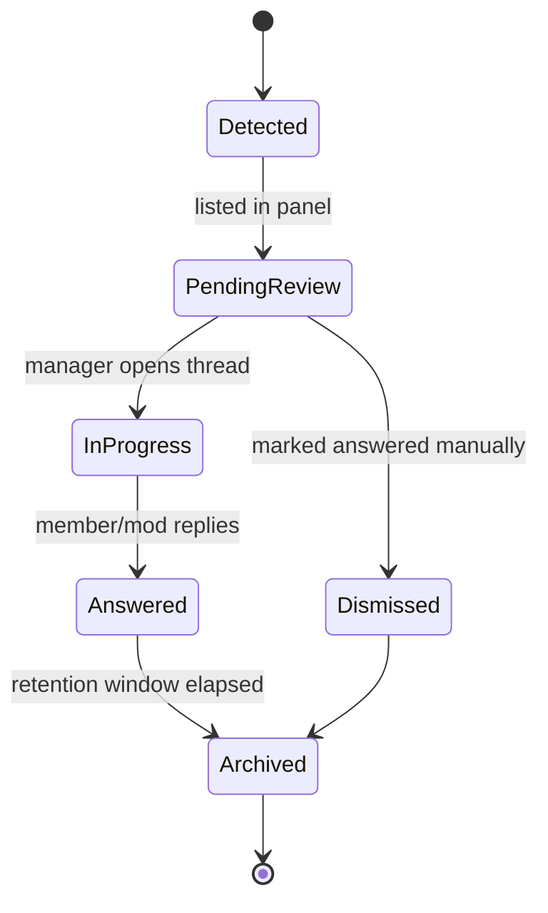
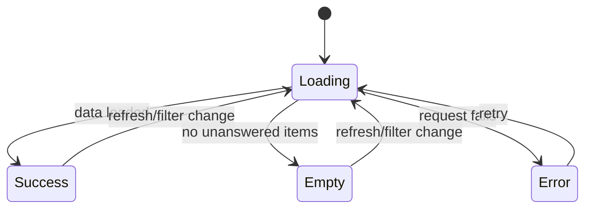
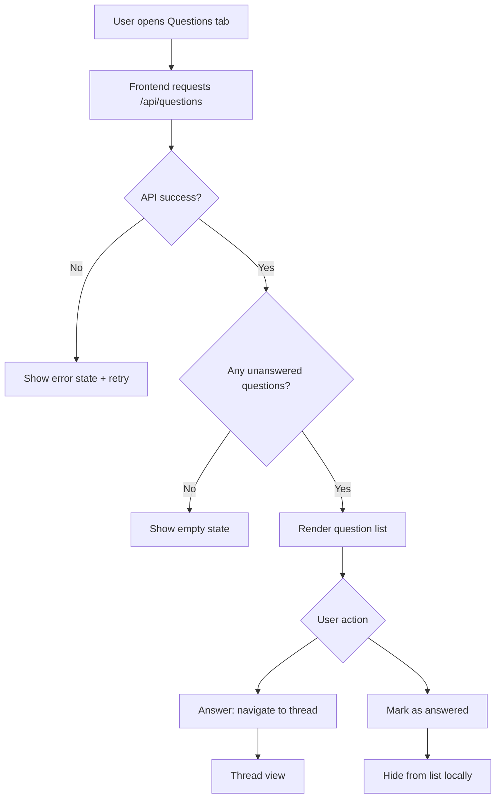

# Dev Specification: User Story 1

## Header
- User Story: As a community manager, I want to see a list of unanswered questions in my channels so that I can ensure no member feels ignored.
- Story Type: Independent
- Primary Persona: Community Manager
- Business Goal: Reduce unanswered member questions and improve response time.
- Scope: Detect and display unanswered questions across selected channels, with actions to jump to thread and mark answered.
- Harmonization Note: This story is implemented in the same backend application as User Story 2 and shares question status and notification domain models.

## Architecture Diagram
### Runtime Placement
- Client: Vite + React UI (Channel list tab, unanswered questions panel).
- Server: Node.js + Express API (question detection query endpoint).
- Data Layer: In-memory mock dataset now; future persistent DB.
- Cloud/Infra: Localhost for development; cloud container/VM in production.

### Information Flow
- Client requests unanswered questions by channel IDs.
- Server aggregates messages, applies question-detection heuristics, and returns normalized question objects.
- Client renders list, supports filtering and mark-as-answered (local UI state now, persistent update later).

### Shared Backend Contract (Harmonized with User Story 2)
- Single backend service: `chatroom-backend` (Express + TypeScript) for both stories.
- Shared domain modules: `QuestionDetectionService`, `QuestionStatusService`, `NotificationService`.
- Shared persistence boundary: messages, question status, notifications in one datastore.
- Shared API namespace: `/api/*` endpoints served by the same application instance.



## Class Diagram


## List of Classes
- Server: Workspace/community container with channels.
- Channel: Text/voice channel metadata.
- Message: Chat message with author and timestamp.
- DetectedQuestion: Derived read model used by the UI.
- QuestionDetectionService: Domain logic for detecting unanswered questions.
- QuestionsApiController: HTTP adapter exposing detection results.
- UnansweredQuestionsPanel: Client-side presentation component.

## State Diagrams
### Unanswered Question Lifecycle


### UI Panel State


## Flow Chart


## Development Risks and Failures
- False positives: statements interpreted as questions.
- False negatives: informal questions without question marks.
- Drift in “answered” logic: replies may be unrelated.
- Performance: scanning large message sets per request.
- UX confusion: local dismiss not persisted across sessions.
- Data consistency: channel/message timestamps from mixed time zones.

## Technology Stack
- Frontend: React, TypeScript, Vite.
- Backend: Node.js, Express, TypeScript.
- Transport: REST over HTTP, JSON payloads.
- Current Storage: In-memory message dataset.
- Planned Storage: PostgreSQL or MongoDB for persistence.

## APIs
- GET /api/questions?channelIds=c1,c2
  - Purpose: Return unanswered questions for optional channel set.
  - Response: DetectedQuestion[]
- GET /api/channels/:channelId/messages
  - Purpose: Retrieve channel messages for navigation context.
- POST /api/channels/:channelId/messages
  - Purpose: Create a new message; backend evaluates unanswered/answered transitions.
  - Side Effect: If a question transitions to answered, backend creates a notification for the asker (User Story 2).
- GET /api/servers
  - Purpose: Resolve channel grouping and names.

## Public Interfaces
- Frontend service functions:
  - getQuestions(channelIds?: string[]): Promise<DetectedQuestion[]>
  - getChannelMessages(channelId: string): Promise<Message[]>
  - createChannelMessage(channelId: string, payload: CreateMessageRequest): Promise<Message>
- Component interface:
  - UnansweredQuestionsProps { channelIds?: string[] }

### Shared Backend Domain Interface
- QuestionStatusService.evaluateTransitionsForChannel(channelId: string): Promise<void>
- NotificationService.createQuestionAnsweredNotification(...): Promise<Notification>

## Data Schemas
### DetectedQuestion
```json
{
  "id": "q-c1-m44",
  "content": "Can anyone help with deployment?",
  "askedBy": "Jordan",
  "askedAt": "2026-03-17T14:03:00.000Z",
  "channelId": "c1",
  "channelName": "general",
  "messageId": "m44"
}
```

### Questions API Response
```json
[
  {
    "id": "q-c1-m44",
    "content": "Can anyone help with deployment?",
    "askedBy": "Jordan",
    "askedAt": "2026-03-17T14:03:00.000Z",
    "channelId": "c1",
    "channelName": "general",
    "messageId": "m44"
  }
]
```

## Security and Privacy
- Enforce role-based authorization for manager-only views in production.
- Limit CORS to approved frontend origins.
- Validate and sanitize query inputs (channelIds).
- Avoid exposing private channels to unauthorized users.
- Minimize personal data in logs; redact message content in error logs.
- Use HTTPS and secure cookies/tokens in deployed environments.

## Risks to Completion
- No persistent “answered” status yet (currently UI-local behavior unless backend QuestionStatus persistence is implemented).
- Heuristic detection may need tuning/testing with real message patterns.
- Missing auth layer can block production rollout.
- Tight timeline if adding persistence + audit trail in same iteration.
- Cross-team dependency: backend schema stabilization for shared US1/US2 contract.

## Acceptance Notes
- Manager can open Questions view and see unresolved items by channel scope.
- Manager can navigate directly to message thread from list item.
- Empty, loading, and error states are visible and functional.
- API and UI contracts documented in this spec.
