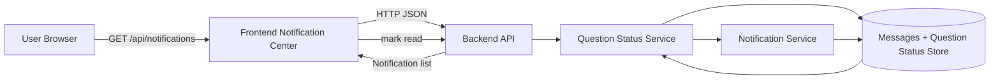
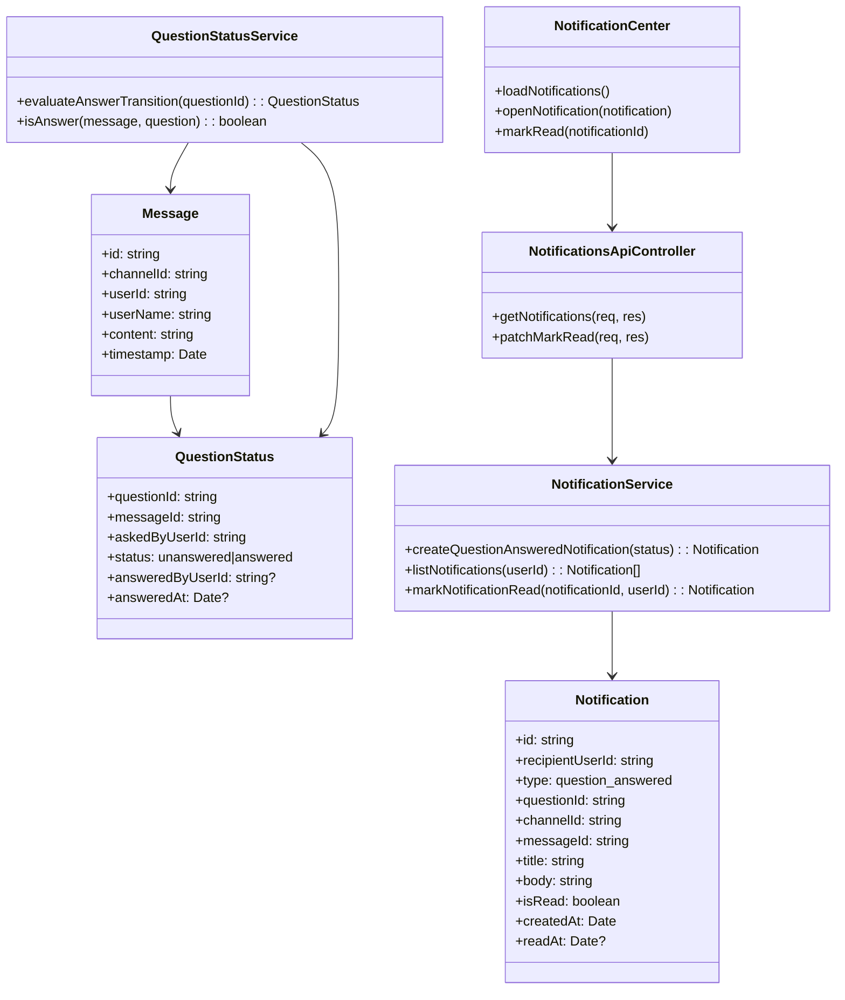
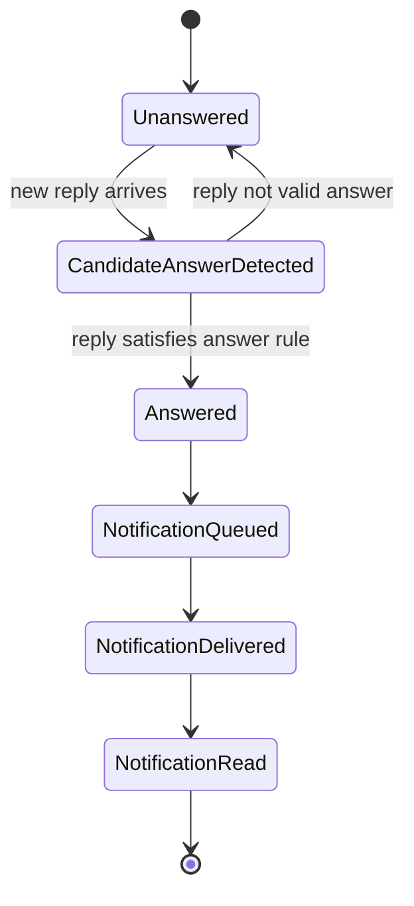
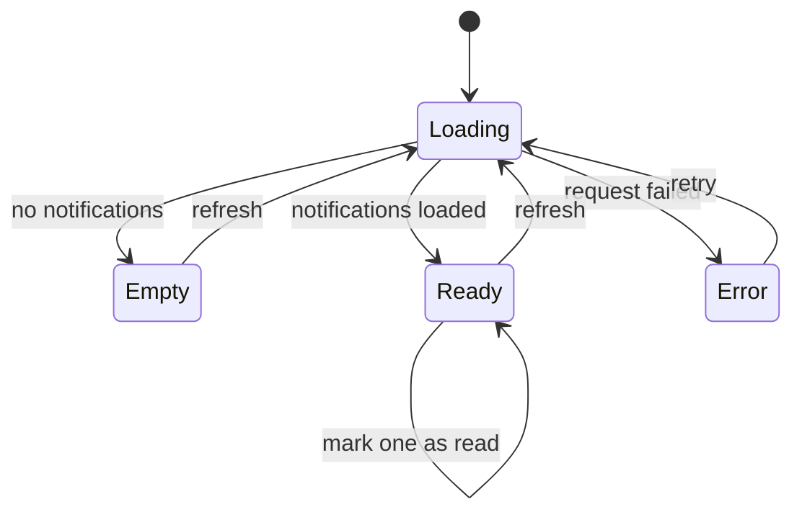
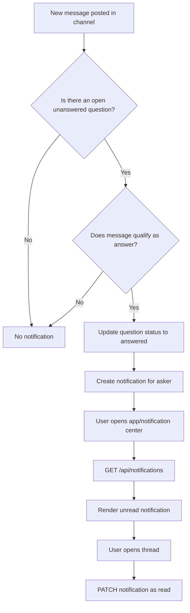

# Dev Specification: User Story 2

## Header
- User Story: As a user, I want to receive notifications when someone answers a question I asked that was previously flagged as unanswered so that I don't miss the response.
- Story Type: Dependent (depends on User Story 1 unanswered-question detection).
- Primary Persona: Member/User who asked a question.
- Business Goal: Improve follow-up visibility and response engagement.
- Scope: Detect transitions from unanswered to answered and deliver in-app notifications to the original asker.
- Harmonization Note: Uses the same `chatroom-backend` service and shared question status model defined by User Story 1.

## Architecture Diagram
### Runtime Placement
- Client: React app (notification bell, unread badge, notification center).
- Server: Express API (question status transition detection + notification generation).
- Data Layer: In-memory data now; future persistent notification table.
- Delivery: Polling in MVP; optional WebSocket/push in later phase.

### Information Flow
- User posts a question, question is tracked as unresolved.
- New replies are evaluated; if reply answers the original question, backend creates a notification record.
- Client fetches notifications and marks them read when opened.

### Shared Backend Contract (Harmonized with User Story 1)
- Single backend service: `chatroom-backend` (Express + TypeScript) for both stories.
- Shared domain modules: `QuestionDetectionService`, `QuestionStatusService`, `NotificationService`.
- Shared data ownership: message ingestion triggers answer-transition checks in the same app.
- Shared API namespace: `/api/*` endpoints, no separate notification microservice.



## Class Diagram


## List of Classes
- Message: Chat message source events used for answer detection.
- QuestionStatus: Tracks lifecycle from unanswered to answered.
- Notification: Read model for user-visible alerts.
- QuestionStatusService: Domain logic for answer transition detection.
- NotificationService: Creates, reads, and updates notifications.
- NotificationsApiController: REST controller for notifications.
- NotificationCenter: Frontend UI component for notification display.

## State Diagrams
### Question-to-Notification State


### Notification UI State


## Flow Chart


## Development Risks and Failures
- Incorrect answer detection may generate noisy notifications.
- Duplicate notifications if answer transition logic is retriggered.
- Missed notifications if state transition fails during race conditions.
- In-memory storage resets on server restart (MVP limitation).
- High polling frequency can increase backend load.

## Technology Stack
- Frontend: React + TypeScript (notification badge + list).
- Backend: Node.js + Express + TypeScript.
- Transport: REST JSON (polling for MVP).
- Optional Upgrade: WebSocket/SSE for near real-time push.
- Storage: In-memory now; planned persistence via PostgreSQL.

## APIs
- GET /api/notifications?userId=u1
  - Purpose: Get user notifications ordered newest-first.
  - Response: Notification[]
- PATCH /api/notifications/:notificationId/read
  - Purpose: Mark notification as read.
  - Body: { "userId": "u1" }
  - Response: Notification
- POST /api/channels/:channelId/messages
  - Purpose: Create message and trigger question transition evaluation in the same transaction flow.
  - Side Effect: If a question transitions to answered, create `question_answered` notification.

## Public Interfaces
- Frontend service functions:
  - getNotifications(userId: string): Promise<Notification[]>
  - markNotificationRead(notificationId: string, userId: string): Promise<Notification>
  - createChannelMessage(channelId: string, payload: CreateMessageRequest): Promise<Message>
- Component interface:
  - NotificationCenterProps { currentUserId: string }
  - NotificationBellProps { unreadCount: number }

### Shared Backend Domain Interface
- QuestionStatusService.evaluateTransitionsForChannel(channelId: string): Promise<void>
- NotificationService.createQuestionAnsweredNotification(...): Promise<Notification>

## Data Schemas
### Notification
```json
{
  "id": "n-1001",
  "recipientUserId": "u1",
  "type": "question_answered",
  "questionId": "q-c1-m44",
  "channelId": "c1",
  "messageId": "m52",
  "title": "Your question has a new answer",
  "body": "Alex replied in #general",
  "isRead": false,
  "createdAt": "2026-03-17T16:40:00.000Z",
  "readAt": null
}
```

### Mark Read Request
```json
{
  "userId": "u1"
}
```

### Notifications API Response
```json
[
  {
    "id": "n-1001",
    "recipientUserId": "u1",
    "type": "question_answered",
    "questionId": "q-c1-m44",
    "channelId": "c1",
    "messageId": "m52",
    "title": "Your question has a new answer",
    "body": "Alex replied in #general",
    "isRead": false,
    "createdAt": "2026-03-17T16:40:00.000Z",
    "readAt": null
  }
]
```

## Security and Privacy
- Enforce authorization so users only access their own notifications.
- Validate notification ownership on mark-read endpoint.
- Sanitize titles/bodies to avoid reflected or stored injection risks.
- Keep notification payload minimal to reduce unnecessary message exposure.
- Apply HTTPS and token-based auth in production deployment.

## Risks to Completion
- Dependency on User Story 1 quality: poor unanswered detection affects notification quality.
- Missing auth implementation can block secure release.
- No persistent queue/store in MVP risks data loss during restarts.
- Potential scope creep if push notifications are added too early.
- Ambiguity in “what counts as an answer” may require product decision.
- Coupling risk: changes to shared question status schema can break both US1 and US2 if versioning is not managed.

## Acceptance Notes
- User receives a new notification when their unanswered question transitions to answered.
- User can open notification and navigate to the answered thread.
- User can mark notifications as read and unread count updates correctly.
- Loading, empty, and error states are visible in notification UI.
- API contracts are defined and testable independently.
